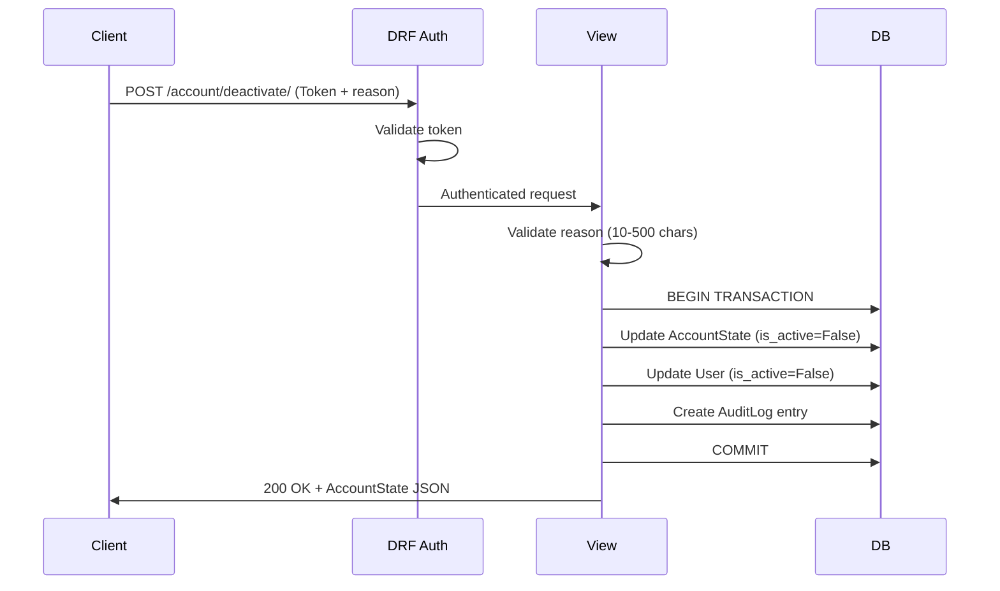

# Account Deactivate / Reactivate API — Documentation

A Django REST Framework API that allows users to deactivate and reactivate their accounts, with full audit trail logging.

---

## Tech Stack

| Layer | Technology | Version |
|---|---|---|
| Framework | Django | 4.2 LTS |
| API | Django REST Framework | 3.17 |
| Auth | DRF Token Authentication | Built-in |
| Database | SQLite | Dev default |
| Language | Python | 3.10+ |

---

## Project Structure

```
PRACTICAL/
├── manage.py                    # Django CLI entry point
├── requirements.txt             # Python dependencies
├── db.sqlite3                   # SQLite database (auto-generated)
│
├── core/                        # Project configuration
│   ├── __init__.py
│   ├── settings.py              # Django + DRF settings
│   ├── urls.py                  # Root URL router
│   └── wsgi.py                  # WSGI entry point
│
└── accounts/                    # Account management app
    ├── __init__.py
    ├── apps.py                  # App config
    ├── models.py                # AccountState, AuditLog
    ├── serializers.py           # Request/response serializers
    ├── views.py                 # Deactivate/Reactivate views
    ├── urls.py                  # App URL routes
    ├── admin.py                 # Admin panel config
    ├── tests.py                 # Automated test suite (9 tests)
    └── migrations/
        └── 0001_initial.py      # Initial database schema
```

---

## API Reference

### Authentication

All endpoints require **Token Authentication**. Include the token in the `Authorization` header:

```
Authorization: Token <your-token-here>
```

To obtain a token, POST your credentials to the token endpoint:

```
POST /api-token-auth/
Content-Type: application/json

{"username": "your_username", "password": "your_password"}
```

**Response:** `{"token": "abc123..."}`

---

### `POST /account/deactivate/`

Deactivates the authenticated user's account.

**Request:**
```json
{
    "reason": "I need a break from the platform."
}
```

| Field | Type | Required | Constraints |
|---|---|---|---|
| `reason` | string | ✅ Yes | 10–500 characters |

**Success Response (200):**
```json
{
    "is_active": false,
    "deactivated_at": "2026-06-24T09:47:35.479802Z",
    "reactivated_at": null,
    "deactivation_reason": "I need a break from the platform."
}
```

**Error Responses:**

| Status | Condition | Body |
|---|---|---|
| `401` | Missing or invalid token | `{"detail": "Authentication credentials were not provided."}` |
| `400` | Missing `reason` field | `{"reason": ["This field is required."]}` |
| `400` | Reason too short (<10 chars) | `{"reason": ["Ensure this field has at least 10 characters."]}` |
| `400` | Account already inactive | `{"detail": "Account is already deactivated."}` |

---

### `POST /account/reactivate/`

Reactivates the authenticated user's account. No request body required.

**Request:**
```json
{}
```

**Success Response (200):**
```json
{
    "is_active": true,
    "deactivated_at": "2026-06-24T09:47:35.479802Z",
    "reactivated_at": "2026-06-24T09:47:48.864314Z",
    "deactivation_reason": ""
}
```

**Error Responses:**

| Status | Condition | Body |
|---|---|---|
| `401` | Missing or invalid token | `{"detail": "Authentication credentials were not provided."}` |
| `400` | Account already active | `{"detail": "Account is already active."}` |

---

## Data Models

### AccountState

One-to-one relationship with Django's `User` model. Tracks the current state of an account.

| Field | Type | Description |
|---|---|---|
| `user` | OneToOneField → User | The account owner |
| `is_active` | BooleanField | `True` = active, `False` = deactivated |
| `deactivated_at` | DateTimeField (nullable) | Timestamp of last deactivation |
| `reactivated_at` | DateTimeField (nullable) | Timestamp of last reactivation |
| `deactivation_reason` | TextField | Reason provided during deactivation |

### AuditLog

Append-only, immutable log of every account state change.

| Field | Type | Description |
|---|---|---|
| `user` | ForeignKey → User | The account affected |
| `action` | CharField (choices) | `DEACTIVATE` or `REACTIVATE` |
| `reason` | TextField | Reason (populated on deactivation, empty on reactivation) |
| `performed_by` | ForeignKey → User (nullable) | Who performed the action |
| `performed_at` | DateTimeField (auto) | When the action occurred |
| `ip_address` | GenericIPAddressField (nullable) | Client IP address |
| `metadata` | JSONField | Extensible field for additional context |

> [!IMPORTANT]
> Audit logs are **immutable**. They cannot be created, edited, or deleted through the Django admin panel. They can only be created programmatically by the API views.

---

## Architecture & Business Logic

### Request Flow



### Key Design Decisions

1. **Dual-state sync**: Both `AccountState.is_active` and `User.is_active` are updated together. `User.is_active = False` immediately blocks the user from logging in through Django's built-in auth system, while `AccountState` stores the richer metadata (timestamps, reason).

2. **Atomic transactions**: All database writes (state update + user update + audit log) happen inside `transaction.atomic()`. If any single write fails, the entire operation is rolled back — no partial states.

3. **Custom authentication for reactivation**: Django's default `TokenAuthentication` blocks inactive users. Since a deactivated user needs to call `/account/reactivate/`, we use a custom `InactiveUserTokenAuthentication` class on that endpoint only. It validates the token without checking `is_active`, allowing inactive users to reactivate themselves.

4. **Immutable audit logs**: The `AuditLogAdmin` disables add/change/delete permissions and marks all fields as read-only. Audit entries can only be created by the API views, never modified.

---

## Testing

### Run the Test Suite

```bash
python manage.py test accounts -v 2
```

### Test Coverage

| Test | Validates |
|---|---|
| `test_deactivate_requires_auth` | Unauthenticated requests are rejected (401) |
| `test_deactivate_requires_reason` | Missing `reason` returns 400 with field error |
| `test_deactivate_reason_min_length` | Reason under 10 chars returns 400 |
| `test_deactivate_success` | Full deactivation flow: 200, state change, audit log |
| `test_deactivate_already_inactive` | Double-deactivation blocked (401 — auth rejects inactive user) |
| `test_reactivate_requires_auth` | Unauthenticated requests are rejected (401) |
| `test_reactivate_already_active` | Reactivating an active account returns 400 |
| `test_reactivate_success` | Full reactivation flow: 200, state restored, audit log |
| `test_audit_log_entries` | Full lifecycle produces 2 ordered audit entries |

---

## Setup Guide

### 1. Install Dependencies
```bash
pip install -r requirements.txt
```

### 2. Apply Migrations
```bash
python manage.py migrate
```

### 3. Create a Superuser
```bash
python manage.py createsuperuser
```

### 4. Start the Dev Server
```bash
python manage.py runserver
```

### 5. Access the Admin Panel
Open `http://127.0.0.1:8000/admin/` and log in with your superuser credentials to view account states and audit logs.

---

## Configuration

All sensitive settings are driven by environment variables with safe development defaults:

| Variable | Default | Purpose |
|---|---|---|
| `DJANGO_SECRET_KEY` | `django-insecure-dev-only-...` | Cryptographic signing key |
| `DJANGO_DEBUG` | `True` | Enable/disable debug mode |
| `DJANGO_ALLOWED_HOSTS` | `*` | Comma-separated allowed hosts |

> [!WARNING]
> For production, you **must** set `DJANGO_SECRET_KEY` to a unique random value, set `DJANGO_DEBUG=False`, and restrict `DJANGO_ALLOWED_HOSTS` to your domain.
